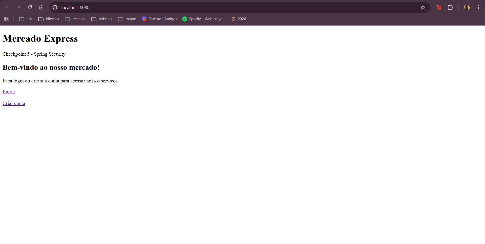
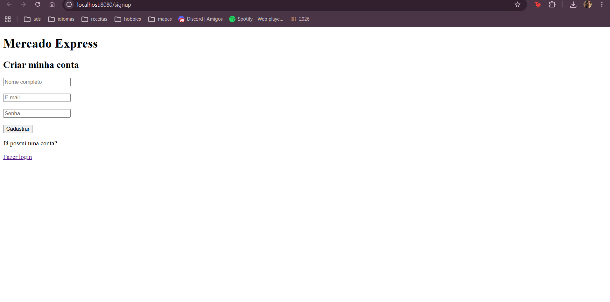
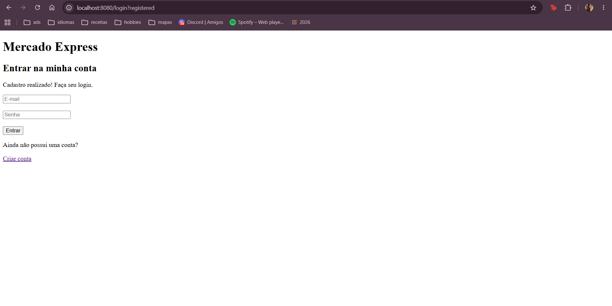
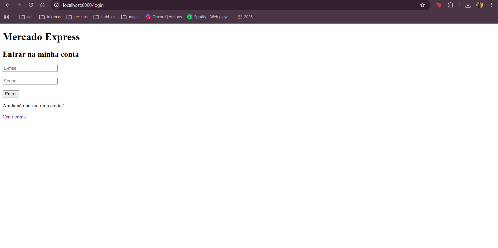
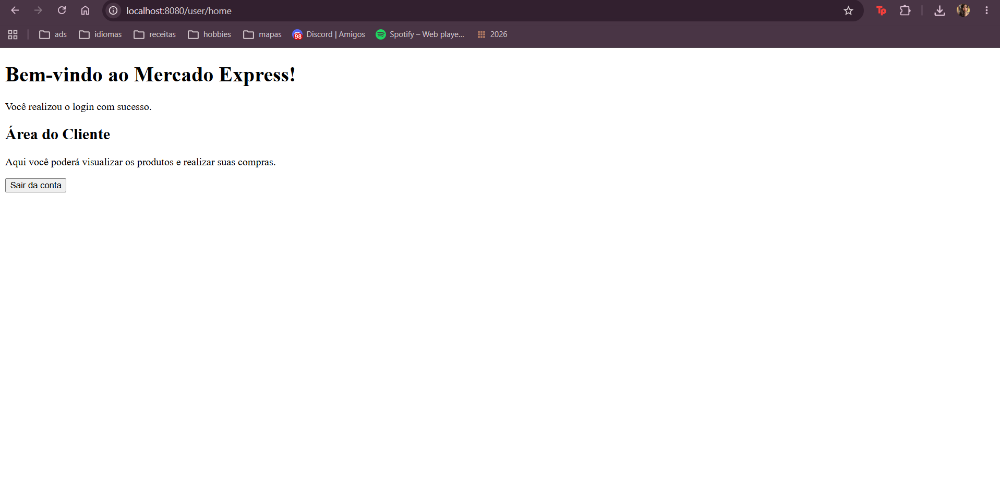
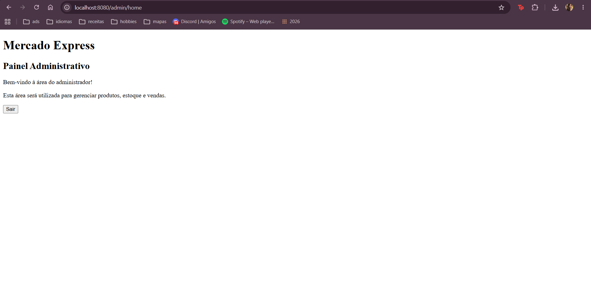
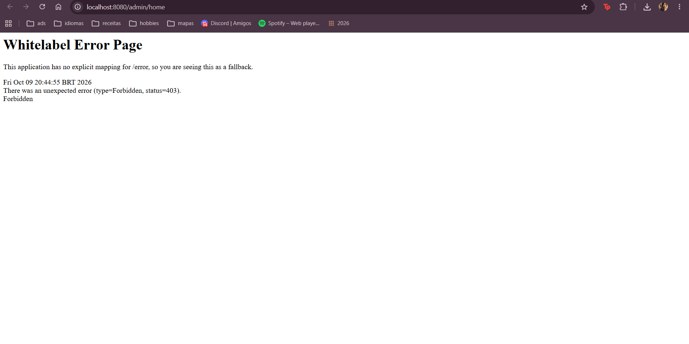
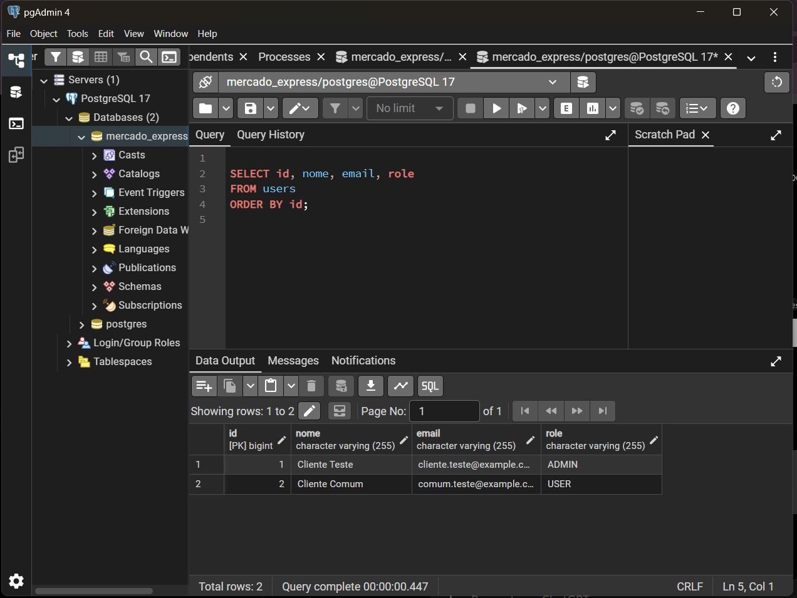
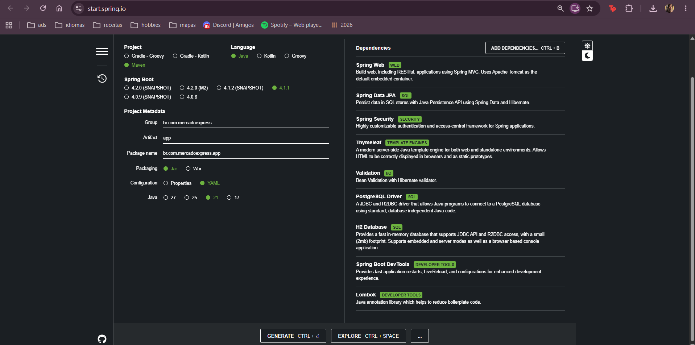

# Mercado Express — Checkpoint 5 | Java Advanced

Projeto acadêmico desenvolvido para a disciplina de Java Advanced da FIAP, utilizando Java 21, Spring Boot, Spring Security, Spring MVC, Thymeleaf, Spring Data JPA e PostgreSQL.

> **Status:** autenticação e autorização implementadas e testadas localmente. O CRUD de produtos, o deploy e os recursos de mensageria/pagamento da Parte 2 ainda serão integrados pelo grupo.

## Objetivo

Construir uma aplicação Web para um mercado express, com cadastro de clientes, login personalizado e áreas protegidas por perfil. O projeto será expandido para gerenciamento de produtos, integração de pagamentos, mensageria e relatórios.

## Tecnologias

- Java 21 e Maven (Maven Wrapper)
- Spring Boot e Spring MVC
- Spring Security
- Spring Data JPA / Hibernate
- PostgreSQL 17
- Thymeleaf e HTML
- BCrypt para hash de senhas
- VS Code (ambiente utilizado nesta etapa)

## Funcionalidades implementadas

### Cadastro de usuários

A página `/signup` permite cadastrar nome, e-mail e senha. O sistema verifica se o e-mail já está cadastrado, normaliza o e-mail, armazena um hash BCrypt da senha e atribui o perfil `USER` por padrão. Após o cadastro, redireciona para `/login?registered`.

### Login personalizado

A página `/login` utiliza um formulário próprio integrado ao Spring Security. As credenciais são verificadas a partir dos usuários armazenados no PostgreSQL.

### Controle de acesso por perfil

- `USER`: acesso à página `/user/home`.
- `ADMIN`: acesso às páginas `/admin/home` e `/user/home`.
- Tentativas de acessar `/admin/home` com perfil `USER` são bloqueadas com HTTP 403.
- Após autenticação, `USER` é redirecionado para `/user/home` e `ADMIN` para `/admin/home`.
- O sistema oferece logout.

> Em ambiente local, um usuário de teste foi promovido manualmente para `ADMIN` no banco, apenas para validar as permissões. O formulário público não permite escolher o perfil administrativo.

## Rotas atuais

| Método | Rota | Acesso | Finalidade |
|---|---|---|---|
| GET | `/` | Público | Página inicial |
| GET | `/login` | Público | Formulário de login |
| POST | `/login` | Público | Processamento da autenticação pelo Spring Security |
| GET | `/signup` | Público | Formulário de cadastro |
| POST | `/signup` | Público | Cadastro de usuário |
| GET | `/user/home` | USER ou ADMIN | Área do cliente |
| GET | `/admin/home` | ADMIN | Área administrativa |
| POST | `/logout` | Autenticado | Encerrar sessão |

## Banco de dados

O PostgreSQL é utilizado para persistência de usuários. Durante os testes, a tabela `users` foi criada pelo Hibernate no banco local `mercado_express`.

Campos observados no teste: `id`, `nome`, `email`, `senha` e `role`.

As senhas não são armazenadas em texto puro: o sistema usa BCrypt. Não publicar senhas, hashes completos nem credenciais reais nos prints.

## Executar localmente (Windows / PowerShell)

**Pré-requisitos:** JDK 21, PostgreSQL em execução, banco `mercado_express` criado e Maven Wrapper incluído no projeto.

Configuração esperada em `src/main/resources/application.yaml`:

```yaml
spring:
  application:
    name: mercado-express
  datasource:
    url: jdbc:postgresql://localhost:5432/mercado_express
    username: postgres
    password: ${DB_PASSWORD}
  jpa:
    hibernate:
      ddl-auto: update
    show-sql: true
  thymeleaf:
    cache: false
server:
  port: 8080
```

No terminal PowerShell, na pasta raiz do projeto:

```powershell
$env:DB_PASSWORD = Read-Host "Digite a senha do PostgreSQL"
.\mvnw.cmd spring-boot:run
```

Acessar `http://localhost:8080`.

> A variável `DB_PASSWORD` é definida somente na sessão atual do terminal. Não incluir credenciais no GitHub. O uso de `ddl-auto: update` é destinado ao desenvolvimento local; rever a estratégia de migrações antes do deploy.

## Evidências de testes manuais

Os seguintes cenários foram executados com sucesso durante o desenvolvimento:

1. Inicialização da aplicação na porta 8080.
2. Abertura das páginas inicial, cadastro e login.
3. Cadastro de usuário e redirecionamento para o login.
4. Consulta ao PostgreSQL confirmando registro em `users`, perfil `USER` e formato BCrypt do hash.
5. Login de usuário comum e abertura de `/user/home`.
6. Login de administrador e abertura de `/admin/home`.
7. Bloqueio de usuário comum em `/admin/home`, com HTTP 403.
8. Redirecionamento automático para a área correspondente ao perfil.

### Prints a adicionar ao repositório

Salvar as imagens em `docs/images/` e substituir os marcadores abaixo por links reais:











## Estrutura principal

```text
src/main/java/br/com/mercadoexpress/app/
├── config/SecurityConfig.java
├── controller/
│   ├── LoginController.java
│   ├── HomeController.java
│   └── AdminController.java
├── entity/User.java
├── repository/UserRepository.java
├── service/UserService.java
└── AppApplication.java

src/main/resources/
├── application.yaml
└── templates/
    ├── index.html
    ├── login.html
    ├── signup.html
    ├── home.html
    └── admin.html
```

## Próximas etapas do grupo

- CRUD de produtos com interface Web e persistência no PostgreSQL.
- Deploy e disponibilização do link público da aplicação.
- Integração com API de pagamentos do Banco Tranquilo.
- RabbitMQ ou LavinMQ, com exchanges, filas e testes de mensageria.
- Confirmação de pagamento por e-mail e registro dos envios no banco.
- Dashboard gerencial de compras, vendas, estoque e resultados.
- Documentação completa, vídeo demonstrativo e demais evidências exigidas no enunciado.

## Equipe

**Integrantes e RMs:** preencher com os dados dos cinco integrantes antes da entrega.

**Repositório:** inserir link definitivo do GitHub.

**Deploy:** pendente.

**IDE:** VS Code nesta etapa; confirmar os ambientes usados pelo grupo para a entrega.
# mercado-express-cp5